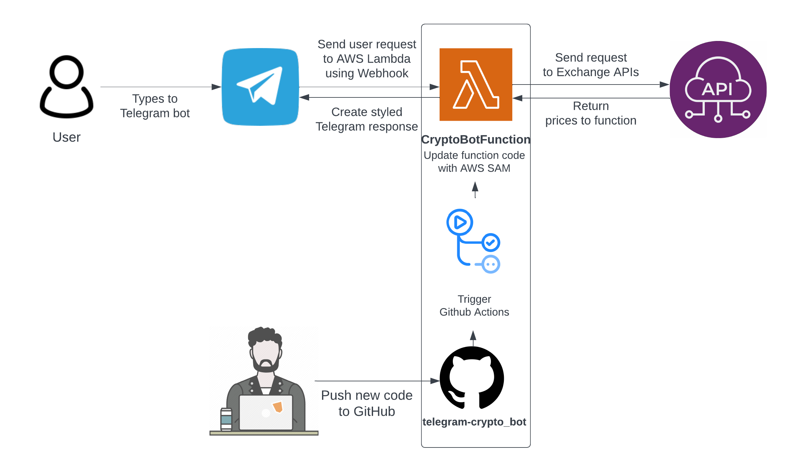

<p align="center">
  <a href="" rel="noopener">
 </a>
</p>

<h3 align="center">Turkish Crypto Exchange Bot</h3>

<div align="center">


[](/LICENSE)


</div>

---

The goal of this Telegram bot is to give the user current price of the cryptocurrencies from Turkish exchanges.
Bot currently supports 2 biggest Turkish exchanges : _Paribu and BTCTurk._  
**Prices are given as Turkish Lira (TRY), Tether (USDT) and BTC pairs (BTC)**

**Medium article:** https://onerince.medium.com/aws-lambda-for-telegram-bots-d02517e1e2f2

## 📝 Table of Contents

- [Demo / Working](#demo)
- [What's New](#new)
- [How it works](#working)
- [Usage](#usage)
- [Test](#test)
- [Future Goals](#goals)
- [Acknowledgments](#acknowledgement)

## 🎥 Demo / Working <a name = "demo"></a>


## :new: What's New <a name = "new"></a>

- July 2019
  - Project creation
- March 2021
  - Switched to python-telegram-bot library for more optimized performance
  - Removed small and closed exchanges
  - Added USDT and BTC pairs
  - Re-organized response message
  - Changed database structure for faster response times
- August 2021
  - Deployed to AWS Lambda
  - Instead of CMC, now getting coin names from exchange APIs when possible (one less request)
- January 2022
  - Now using AWS SAM to deploy Lambda, instead of manually uploading zip file :-)
  - Created GitHub Actions Workflows to automatic deployment and tests

## 💭 How it works <a name = "working"></a>

Telegram has a webhook functionality for bots, so every time a message sent to a bot it is possible to process that
request information to an external API service. I have used AWS Lambda and AWS API Gateway for this purpose.



## 🎈 Usage <a name = "usage"></a>

Verify template file:

```
sam validate
```

Build application:

```
sam build --use-container
```

Deploy function to your own AWS account or Telegram bot:

```
sam deploy --guided
```

## :video_game: Test <a name = "test"></a>

Run Python unit tests

```
make test
```

Invoke function locally using sample event (telegram bot message event)

```
sam local invoke CryptoBotFunction -e events/event.json
```

Instead of invoking function, you can also run it as an HTTP server. Port is 3000 as default.

```
sam local start-api --env-vars env.json
```

You can control your code standards performing static - type checks and formatting code automatically.
Run all these tests with;

```
make ci
```

Bot is active on **@python_koin_bot** on Telegram

### Prerequisites

**1. Installing required packages**

To test and use this codebase; AWS SAM, AWS CLI and Docker must be installed. Also, AWS CLI profile must be configured.

For install instructions and detailed guide:

https://aws.amazon.com/tr/serverless/sam/

**2. Env Variables**

Running unit tests with Python requires env variables in a dotenv file. Example file: [.env.dist](.env.dist)

To invoke Lambda function locally with [sam local](https://docs.aws.amazon.com/serverless-application-model/latest/developerguide/sam-cli-command-reference-sam-local-invoke.html),
SAM template file need env variables in env.json file. Example file: [.env.json.dist](.env.json.dist)

To use this bot, you'll need a Telegram bot Token
Any secrets must exist in environment variables.

- [CoinMarketCap API](https://pro.coinmarketcap.com/signup/)
- [Telegram Bot Token](https://core.telegram.org/bots#creating-a-new-bot)

## :dart: Future Goals <a name = "goals"></a>

- Output in a more organized way. (like a table)
- Implement an algorithm which detects arbitrage opportunities and notifies user.
- Allow user to set a notification alarm for a specific coin.

## 🎉 Acknowledgements <a name = "acknowledgement"></a>

- [Telegram Bot Doc.](https://core.telegram.org/bots) - To understand basic bot commands and process
- [AWS SAM Reference](https://aws.amazon.com/tr/serverless/sam/) - SAM Documentation
- [AWS Lambda Deployment with Github Actions](https://www.sufle.io/blog/aws-lambda-deployment-with-github-actions) - Github Action Deployment
